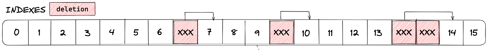

# `sparse-arr-lib` 

> **Warning**
> This library is unfinished & is a WIP. Use discretion, don't test in prod.

A library to assist with utilizing sparse storage arrays in Solidity.

## Rationale

In Solidity, it is impossible to delete an element from the middle of a storage array without shifting all elements
following the deleted element, disrupting order, or leaving a gap. This library is an experiment to enable the use of a
**sparse array**-esq data structure to combat this shortcoming as efficiently as possible.

### Intended Behavior

### How does it work?
*TODO*

### Current limitations:
- Elements must be deleted linearly and in continuously ascending order. (i.e., one cannot delete index `5` and then `3`)
  - BUG: An element may not be deleted at the same index more than once. 
- *TODO*

## Usage
*TODO*
